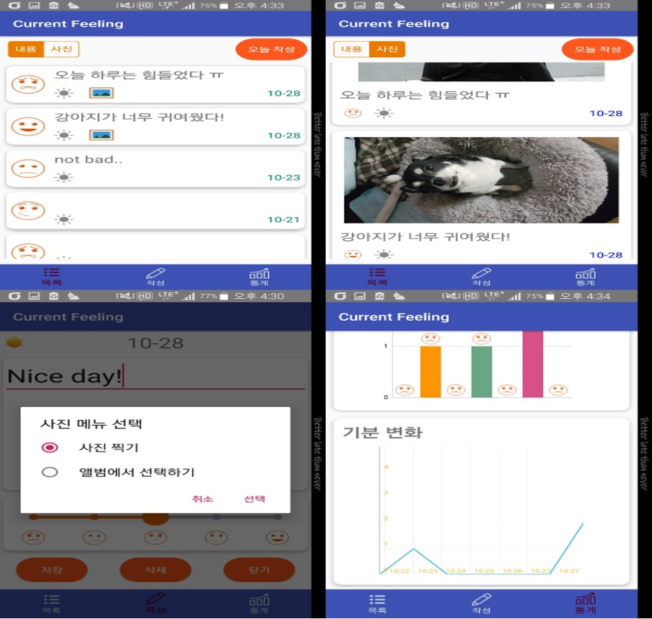
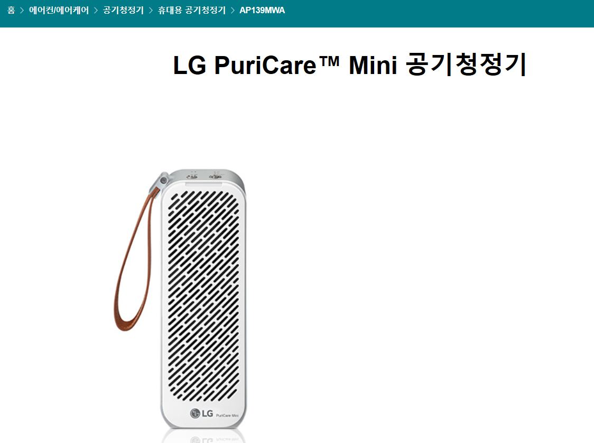
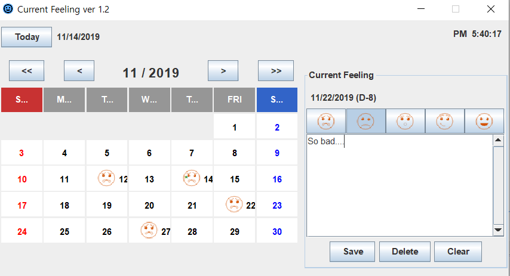
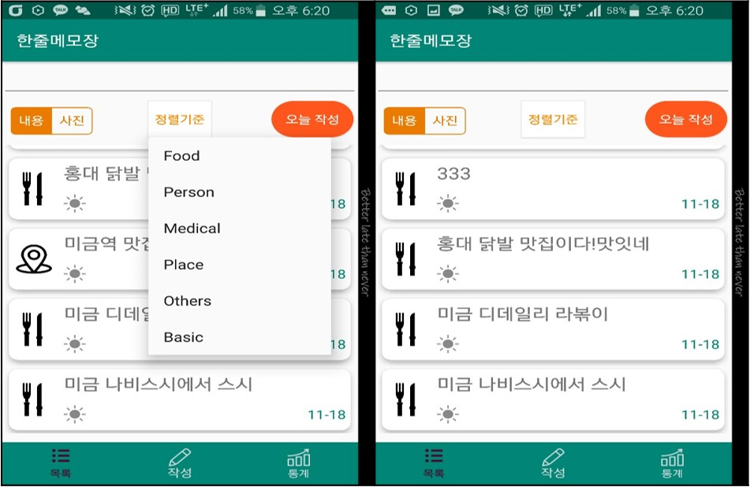
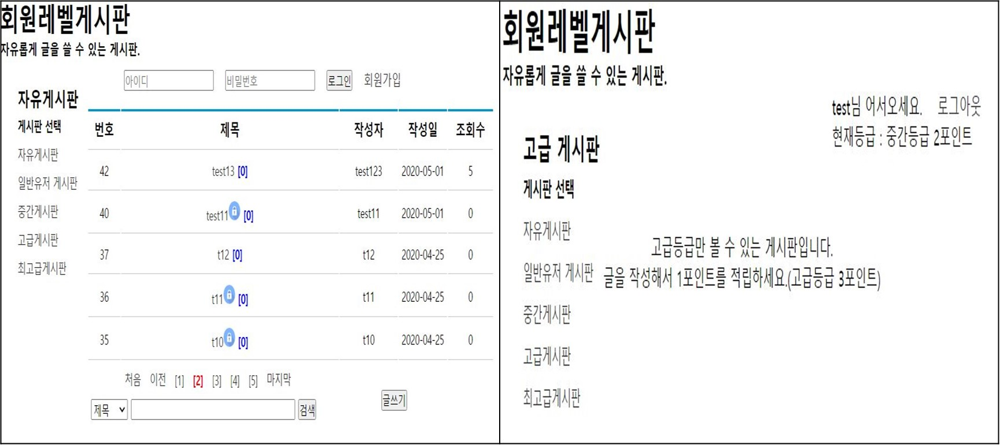
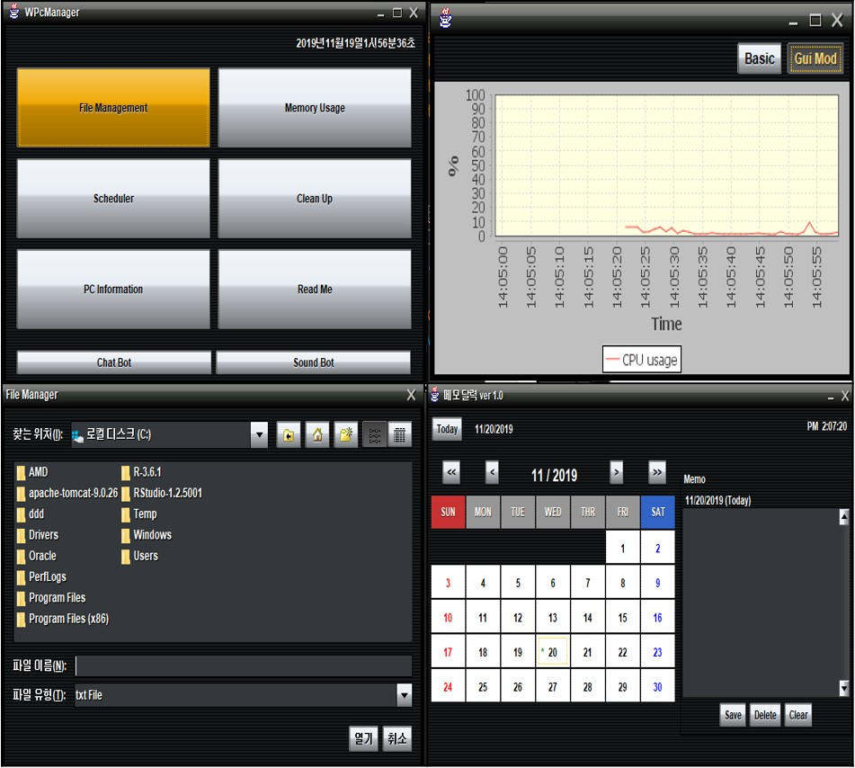
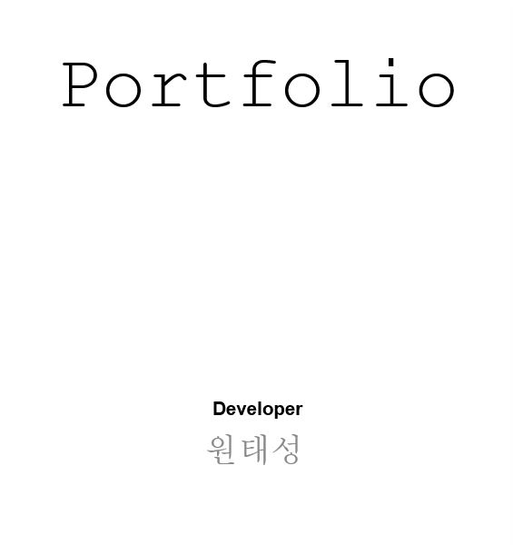

<!DOCTYPE HTML>
<!--
	Hyperspace by HTML5 UP
	html5up.net | @ajlkn
	Free for personal and commercial use under the CCA 3.0 license (html5up.net/license)
-->
<html>
	<head>
		<title>Developer Portfolio</title>
		<meta http-equiv="Content-Type" content="text/html; charset=utf-8" />
		<meta name="viewport" content="width=device-width, initial-scale=1, user-scalable=no" />
		<link rel="stylesheet" href="assets/css/main.css" />
		<noscript><link rel="stylesheet" href="assets/css/noscript.css" /></noscript>
	</head>
	<body class="is-preload">

		<!-- Sidebar -->
			<section id="sidebar">
				

					<nav>
						<ul>
							<li><a href="#intro">Welcome</a></li>
							<li><a href="#one">Project</a></li>
							<li><a href="#two">Personal History/Skills</a></li>
							<li><a href="#three">Contact</a></li>
						</ul>
					</nav>
				

			</section>

		<!-- Wrapper -->
			

				<!-- Intro -->
					<section id="intro" class="wrapper style1 fullscreen fade-up">
						

							<h1>원태성의 포트폴리오</h1>
							
늘 한자리에 안주하지 않고 실패를 두려워 하지 않고 밑거름으로 삼아 성장의 원동력으로 삼아 최고가 되기위해 노력하겠습니다.

							
Better late than never&nbsp;&nbsp;&nbsp;
							2020.05.29 Update

							<ul class="actions">
								<li><a href="#one" class="button scrolly">Start</a></li>
							</ul>
						

					</section>

				<!-- One -->
					<section id="one" class="wrapper style2 spotlights">
						<section>
							
							

								

									<h2>Current Feeling</h2>
									
현재 기분을 사진과 글, 단계별 이모티콘으로 표현하고 현재 지역날씨와 기분별 비율/통계를 차트별로 보여주는 일기장 형식 애플리케이션

									
#Android/Java Client #location #MediaStore #XmlParserCreator/GsonXml
									<ul class="actions">
										<li><a href="https://github.com/won4932/CurrentFeeling.git" class="button">View code</a></li>
									</ul>
								

							

						</section>
						<section>
							
							

								

									<h2>가전제품 홍보 사이트</h2>
									
여러 사이트에서 분야에 해당하는 제품들을 한 곳에 모아서 보여주는 사이트 구축

									
#HTML/CSS/JS/JQuery Client/Server #html5shiv #반응형 웹 #크로스브라우징
									<ul class="actions"> 
										<li><a href="https://github.com/won4932/WebStandardFramework.git" class="button">View code</a></li>
									</ul>
								

							

						</section>
						<section>
							
							

								

									<h2>Current Feeling(PC)</h2>
									
안드로이드 앱 버전을 한눈에 보기 쉽게 PC버전으로 구성한 PC플랫폼 프로그램(모바일과 데이터 연동 진행 중)

									
#SpringMVC기반 Server #LinkedHashMap #Calendar #firebase4j #JsonParser
									<ul class="actions">
										<li><a href="https://github.com/won4932/Current-Feeling-PC.git" class="button">View Code</a></li>
									</ul>
								

							

						</section>
					<section>
							
							

								

									<h2>OneNote(한줄메모장)</h2>
									
분야별로 메모를 할 수 있는 간단 한줄메모장 어플리케이션

									
#Android/JAVA Client #SQLite #Filter/TextWatcher
									<ul class="actions">
										<li><a href="https://github.com/won4932/OneNote.git" class="button">View Code</a></li>
									</ul>
								

							

						</section>
					<section>
							
							

								

									<h2>MemberLevelBoard</h2>
									
게시판별로 회원레벨을 부여해서 레벨별로 열람이 가능 한 게시판 구축

									
#HTML/JS/CSS/PHP기반 Apache Client/Server #password_hash

									<ul class="actions">
										<li><a href="https://github.com/won4932/MemberLevelBoard.git" class="button">View Code</a></li>
									</ul>
								

							

						</section>
					<section>
							
							

								

									<h2>WPcManager</h2>
									
PC를 관리해주는 여러 기능들을 오픈소스와 내장라이브러리를 적용해 구축한 PC 매니지먼트 프로그램

									
#JAVA Client #jfree.chart #sun.ids.kkma/sigar/lang.management #swing

									<ul class="actions">
										<li><a href="https://github.com/won4932/WPcManager.git" class="button">View Code</a></li>
									</ul>
								

							

						</section>
					<section>
							
							

								

									<h2>View Detail</h2>
									
위 프로젝트들의 개발환경 및 간단한 코드 설명을 보고싶다면 PPT형식의 파일을 참조

									<ul class="actions">
										<li><a href="generic.html" class="button">File DownLoad</a></li>
									</ul>
								

							

						</section>
					</section>

				<!-- Two -->
					<section id="two" class="wrapper style3 fade-up">
						

							<h2>Personal History/Skills</h2>
							

								<section>
									
									<h3>Personal History</h3>
									
(주)엠아이웍스/개발 및 유지보수팀/인턴 
									2018.07.02. ~ 2018.07.27 
									하교 현장체험 학습 아이나비 네비게이션관련 개발 및 유지보수

									
(주)세이프티아/개발팀/PM부서/사원 
										2020.04.01 ~ 2020.05.23 
										프로젝트 요구사항 및 리스크 분석 등 프로젝트 관리
									

								</section>
								<section>
									
									<h3>Skills</h3>
									
Language & Framework : JAVA, Kotlin, PHP, JSP, Javascript, SpringBoot, Bootstrap

									
Data Base : Oracle, MySQL, MariaDB

									
IDE & Tools : Eclipe, Intellij, AndroidStudio, STS, R studio, SQLgate, DBbrower

									
Others : Git, HTML/CSS, JQuery, JPA

								</section>
							

							<ul class="actions">
								<li><a href="generic.html" class="button">Skills Resume</a></li>
							</ul>
						

					</section>

				<!-- Three -->
					<section id="three" class="wrapper style1 fade-up">
						

							<h2>Contact</h2>
								<ul class="icons">
									<li><h3>Name/Email</h3></li>
									<li></li>
									
원태성 / won4932@naver.com

								</ul>
						

					</section>
		<!-- Footer -->
			<footer id="footer" class="wrapper style1-alt">
				

					<ul class="menu">
						<li>&copy; Untitled. All rights reserved.</li><li>Design: <a href="http://html5up.net">HTML5 UP</a></li>
					</ul>
				

			</footer>

		<!-- Scripts -->
			
			
			
			
			
			
			

	</body>
</html>
